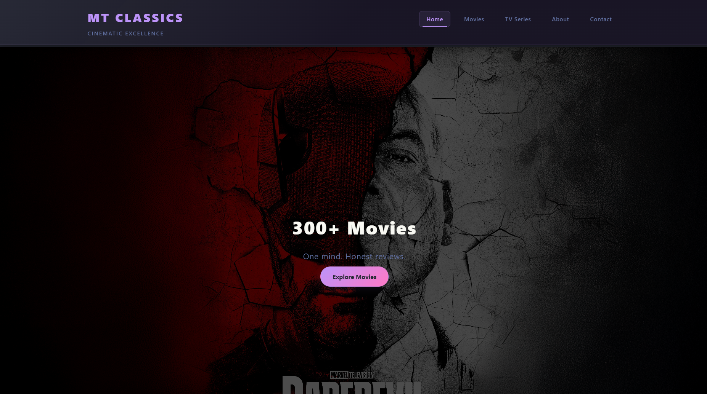
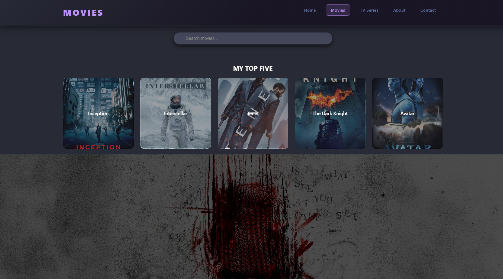
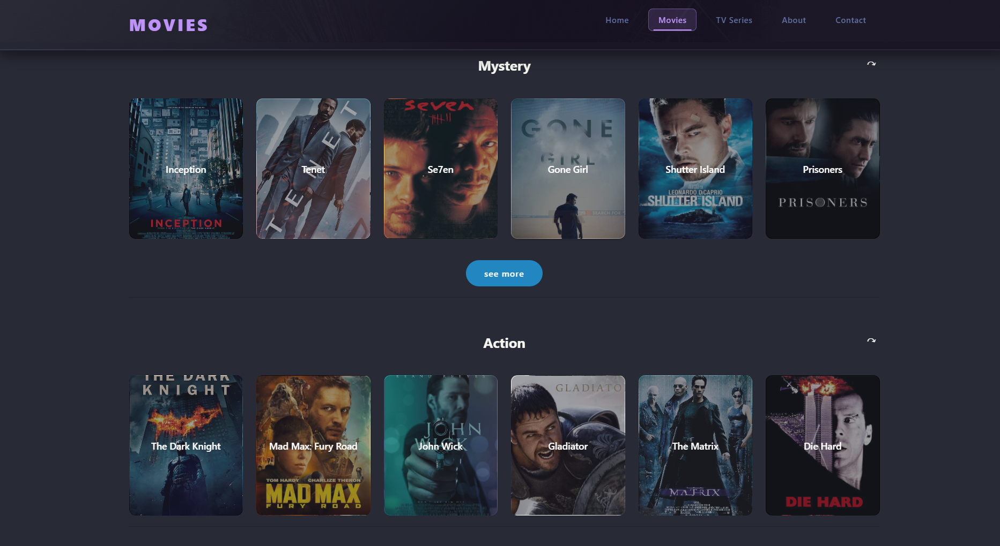

## 🌐 Live Demo
👉 https://mkmconnects-byte.github.io/MT-Classics/

# 🎬 MT Classics

MT Classics is a movie review and streaming-style web platform developed for film enthusiasts who appreciate both classic and modern cinema. The project aims to create a structured and immersive environment where users can explore curated film collections, read in-depth reviews, and access selected viewing or trailer content within a single, cohesive interface.

The platform is built around clarity and user experience. Films are organized into well-defined genre categories such as Action, Mystery, and Drama, enabling intuitive navigation. Extended collection pages are implemented to maintain a clean main layout while still providing access to a broader catalog of titles. This approach balances content depth with visual simplicity.

The interface follows a modern dark-themed design to enhance the cinematic feel while preserving readability and accessibility. Careful attention has been given to spacing, typography, layout hierarchy, and visual consistency to ensure a refined presentation. The site is fully responsive, adapting seamlessly across desktop and mobile devices to maintain functionality and design integrity.

From a development standpoint, MT Classics demonstrates structured front-end architecture, modular styling practices, and interactive UI behavior. The project emphasizes clean code organization, scalable layout design, and maintainable component structure. Performance optimization and responsive principles are applied to ensure smooth interaction and efficient rendering.

MT Classics is currently under active development. The platform is not yet complete, and future updates will introduce additional features, refined design elements, expanded movie collections, and enhanced interactivity.

This project serves as both a portfolio showcase and an evolving creative platform, reflecting continuous improvement in design thinking, user experience, and front-end development practices.

## ✨ Features

- 🎬 Dynamic movie grid
- 🔍 Genre categorization
- 🎥 Trailer integration
- 🌙 Modern dark UI
- 📱 Responsive design

## 🛠 Tech Stack

- HTML5
- CSS3
- JavaScript (Vanilla)
- GitHub Pages

## 📸 Preview

### 🏠 Home Page

### 🎬 Movies Grid

### 🎥 Movie Details

